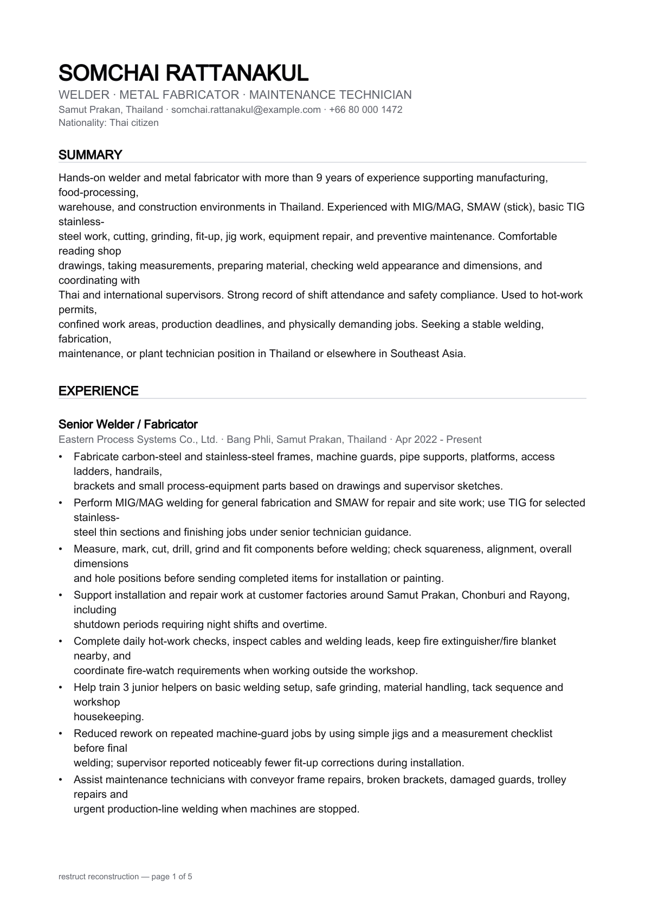
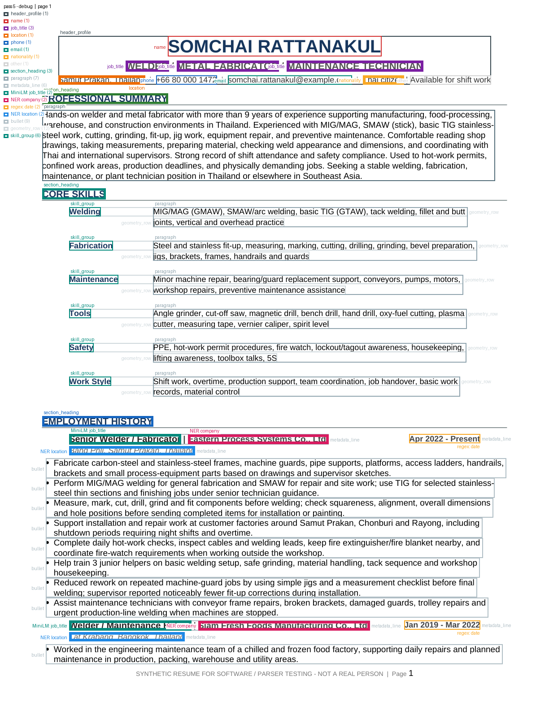
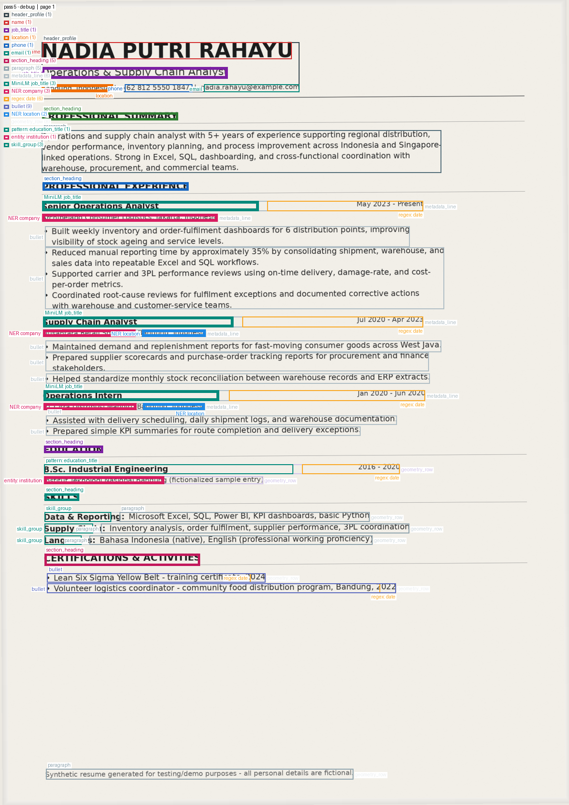

<h1 align="center">Restruct</h1>

<p align="center">
  <a href="https://pypi.org/project/restruct-cv/"></a>
  <a href="https://pypi.org/project/restruct-cv/"></a>
  <a href="https://github.com/Nye1nChanSoe/restruct-cv/blob/master/LICENSE"></a>
</p>

<h3 align="center">Turn a resume PDF, DOCX, or a Scan into clean, consistent JSON.</h3>

<h4 align="center">Runs entirely on your machine. No upload, no API key.</h4>

---

Restruct reads a resume the way a person does: it looks at the layout, finds the sections, and
pulls out the name, the contact details, the jobs, the dates, the schools, the skills.

The result has **the same shape every time**, whatever the resume looked like, ready to drop into
an applicant tracking system, a search index, or an analytics pipeline.

- **PDF, DOCX and scanned pages.** One command, one output shape for all three.
- **Fully local.** The models are files on your disk; nothing leaves the machine.
- **Sixteen fixed sections.** Always present, always in the same order, never a missing key.
- **Two ways to check the result.** Draw it back as a page, or see it drawn on the original.
- **Careful by default.** What it isn't sure about goes to `others`, not into the wrong field.

<br>

## Why Restruct exists

Restruct grew out of my work on [Open LinkedOut](https://github.com/Nye1nChanSoe/open-linkedout), a lightweight, local-first job scraping and matching system.
Small local models consumed too much RAM and disk space while still hallucinating resume details.
Restruct takes a more deterministic and resource-efficient approach,
leaving language models to what they do best **contextual understanding**, not **factual extraction**.

<br>

## Install

```bash
uv add restruct-cv
uv run restruct --install-models
```

<br>

**About those two commands**

- The distribution is **`restruct-cv`**; the command it installs is **`restruct`**. The
  unqualified name was already taken on PyPI by an unrelated project.
- `--install-models` downloads the two models Restruct uses: **352 MB, once**. They are ordinary
  local files, verified by checksum as they arrive.
- It is the **only** command that touches the network. Everything after it works offline.

<br>

**Scanned resumes**, the ones that are pictures of pages with no text inside them, also need
Tesseract. A normal PDF or DOCX never asks for it.

```bash
brew install tesseract                 # macOS
apt-get install tesseract-ocr          # Debian / Ubuntu
```

<br>

## Use it

```bash
uv run restruct resume.pdf -o .
```

That writes `resume.json` next to you, and prints nothing.

**`-o` takes a file or a directory:**

| You write     | You get                                |
| ------------- | -------------------------------------- |
| `-o out.json` | exactly that file                      |
| `-o .`        | `resume.json` in the current directory |
| `-o results/` | `resume.json` inside `results/`        |

A directory gets `<resume>.json`, **named after the input**, so extracting several resumes into
one place doesn't have each one overwrite the last.

<br>

## See what was understood

```bash
uv run restruct resume.pdf -o . --reconstruct
```

<p align="center">
  
</p>

This draws the extracted result **back out as a readable page**, `reconstruction.pdf` plus a PNG
per page, built only from what was extracted, with the original layout thrown away.

That's the whole point:

- A bullet filed under the wrong section is **obvious at a glance** here, and invisible in a wall
  of JSON.
- A date read as a job title shows up in the wrong line of the header.
- Anything Restruct **could not place** is drawn in red under `UNPLACED`, rather than quietly
  dropped.

It is deliberately **not** a facsimile. Imitating the original layout would hide the very errors
it exists to reveal.

You can also draw a result you already have, without re-extracting anything:

```bash
uv run restruct resume.json --reconstruct
```

<br>

## Check it is ATS-friendly

```bash
uv run restruct resume.pdf -o . --ats
```

<p align="center">
  
</p>

Alongside the JSON you get **an overlay of every page**, showing exactly what a parser could read
and where it thought each section began and ended.

- Boxes in the **wrong places, or missing**, are the layouts machines choke on: side-by-side
  columns, text inside a graphic, a table nested in a table.
- Each box is **labelled with the field it became**: `name`, `job_title`, `bullet`, `skill_group`.
- **Heavier boxes are model conclusions.** Lighter ones are things the document stated outright,
  so you can tell a guess from a fact.

Scans go through the same path. OCR is rebuilt into the same geometry a native PDF produces, so a
scanned page gets an overlay that looks like any other:

<p align="center">
  
</p>

<br>

## What you get back

`resume.json` is **plain data**: no bounding boxes, no model names, no confidence scores.

```json
{
  "schema_version": "1.0",
  "header_profile": { "name": "…", "emails": ["…"], "phones": ["…"] },
  "summary": null,
  "experience": [{ "job_titles": ["…"], "companies": ["…"], "bullets": ["…"] }],
  "education": [],
  "…": "…",
  "others": []
}
```

- **Sixteen sections**, always present, always in the same order.
- `null` when the resume has none, `[]` when the section exists but yielded nothing, **never
  absent**.
- [`resume.schema.json`](resume.schema.json) is the published contract, and every release is
  validated against it.
- A section Restruct isn't confident about goes to **`others`, with its original heading kept**,
  rather than being guessed into the wrong place.

Restruct is deliberately careful about what it claims. **v1 targets single-column resumes**, and a
layout whose reading order can't be recovered is _recorded_ as such, never silently repaired into
something that reads plausibly and is wrong.

<br>

### From Python

```python
from restruct import extract_resume
```

Failures are raised as **typed exceptions**, so embedding Restruct in a service doesn't cost you
your process. The command-line tool turns those into exit codes instead, grouped by decade:

| Code | Meaning                                                         |
| ---- | --------------------------------------------------------------- |
| `0`  | success                                                         |
| `1x` | input: not found, unsupported format, unreadable document       |
| `2x` | environment: models missing, Tesseract missing, download failed |
| `3x` | extraction                                                      |
| `4x` | output                                                          |

<br>

## Examples

Three extracted resumes are committed under [`examples/`](examples/), one per kind of input:

| Example                             | Source              | What's in it                                     |
| ----------------------------------- | ------------------- | ------------------------------------------------ |
| [`7.anomaly/`](examples/7.anomaly/) | native PDF, 3 pages | JSON and a page overlay per page                 |
| [`9.ocr/`](examples/9.ocr/)         | scanned PDF         | the same shapes, recovered by OCR                |
| [`11/`](examples/11/)               | DOCX                | JSON only, because a DOCX has no page to draw on |

Worth a look before installing anything.

<br>

## Contributing

Contributions are welcome. See **[CONTRIBUTING.md](CONTRIBUTING.md)** for the setup, the test
suite and the accuracy scorecard, and `CLAUDE.md` for the design decisions behind each module.

> ⚠️ Please do **not** submit real resumes, or labels derived from them. The fixtures in
> `resumes-synthetic/` are synthetic and safe to commit.

<br>

## License

[MIT](LICENSE)
